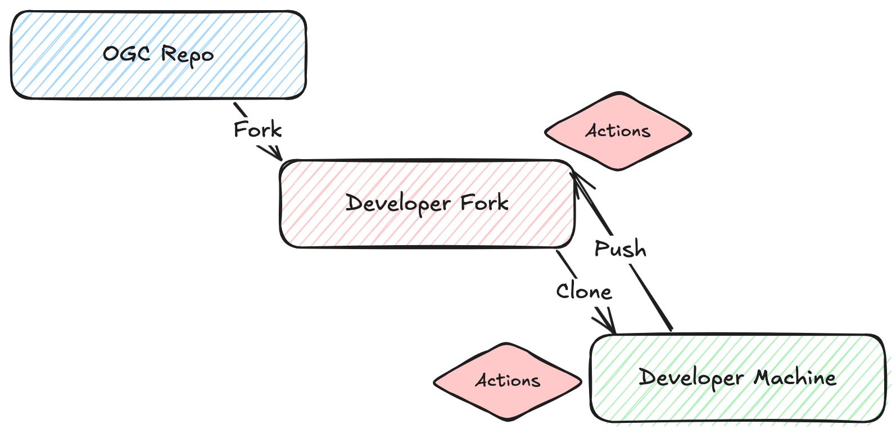
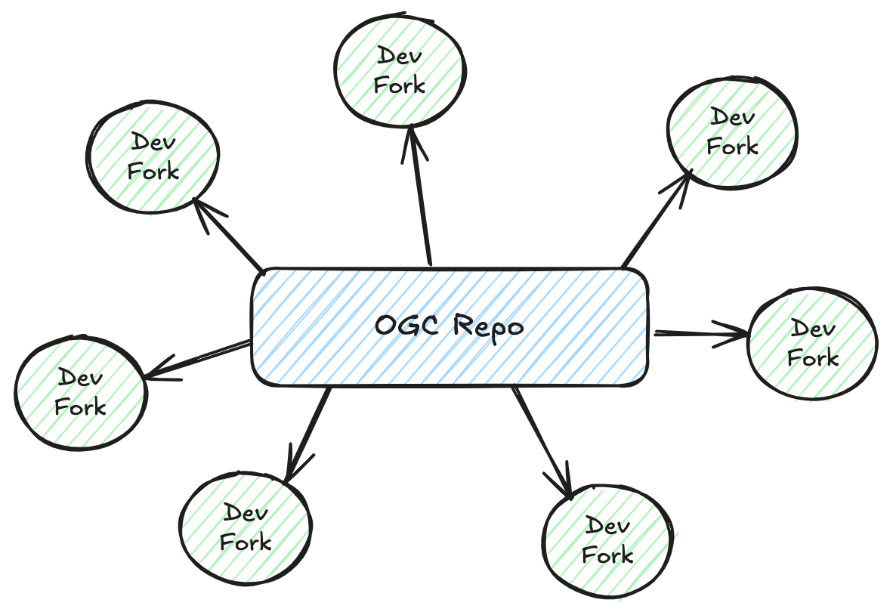

# Data Publisher Exercise

This proof of concept, shows how GitHub actions can be setup to test a OGC API publishing exercise.

## Context

* The goal of this exercise is to publish the [Greater_Hyderabad_Municipal_Corporation_Ward_Boundaries](./data/greater_hyderabad_municipal_corporation_ward_Boundaries.geojson) GeoJSON file, stored in the data folder, as a OGC API - Features collection.
* Developers should achieve this using a [docker compose file](./docker-compose.yml), and a [pygeoapi configuration file](./pygeoapi.config.yml). The server can be instantiated using the latest pygeoapi docker image, pulled from Docker Hub.
* It is important to run the server on port 5000!

### Developer Workflow

* Fork a template repository similar to this one, which should contain a blank docker compose and pygeoapi config file.
* If necessary, enable GitHub actions on the fork.
* Do the necessary changes to docker-compose.yml and the pygeoapi configuration file.
* Push the changes to the fork and wait for the tests to pass.
* You can also test the GitHub actions locally, using [act](https://github.com/nektos/act): act -j docker

### GitHub Actions

* Start the services on the docker compose file.
* Run tests to check if the server is up & running, and if the features collections endpoint responds.
* Stop the services on the docker compose file.
* If any tests fail, there will be info in the Actions log.

### Tests

Github actions are setup to run two sets of tests. The [python tests](./tests/test-api.py) are currently checking if the server is running and if a given collection is published, but they could test anything we want. The [compliance tests](https://github.com/OSGeo/cite-runner) use team engine underneath, and test for compliance of OGC API - Features, part 1 and 2. 