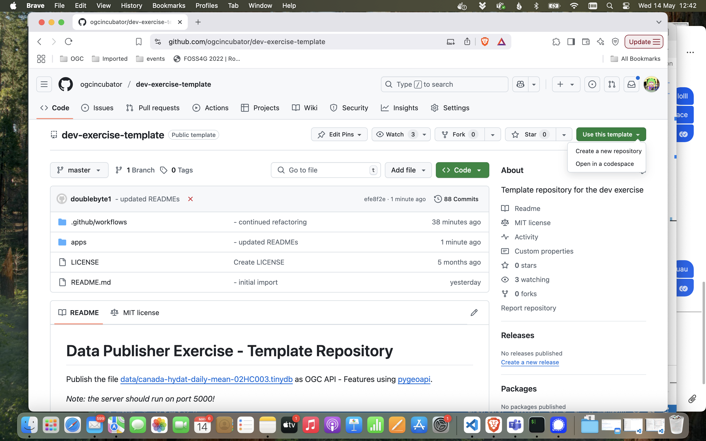
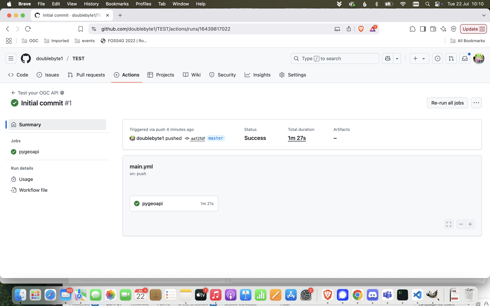
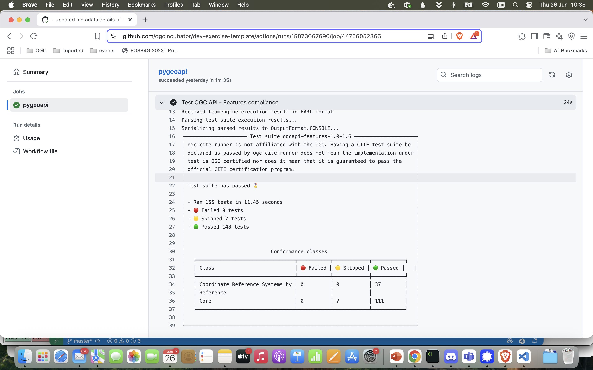
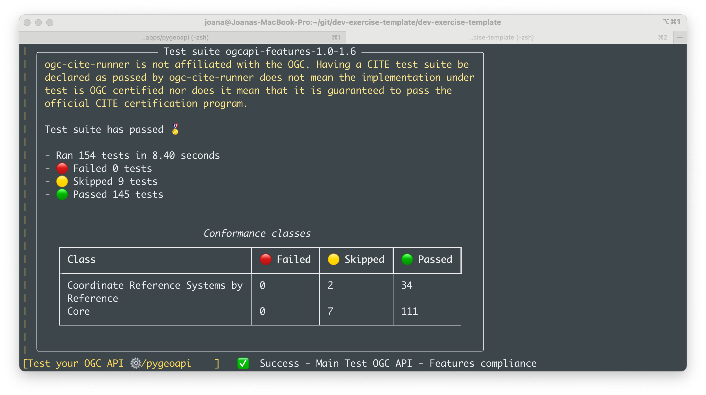

# Data Publisher Exercise - Template Repository

Please follow these steps to complete the Module 3 assignment.

Before starting, make sure that:

- ✅ *You have a GitHub account. Create one here: https://github.com/signup*
- ✅ *You have Git installed in your machine. Although you are welcome to use a Git UI, the instructions provided here assume you will be using the command line interface.*

## Create your repository

Go to https://github.com/ogcincubator/dev-exercise-template and create a repository from this template on your user space, following the steps in the screenshots below.




Clone your repository. Although you can use graphical tools to clone a repository, the rest of this exercise will assume you will use the terminal. For instance if your username is `foo` and your repo is named `data-publisher`, you would clone it in the Command Line Interface (cli) as follows:

```bash
git clone https://github.com/foo/data-publisher.git
```

Then navigate to that repository:

```bash
cd data-publisher
```

## Complete the exercise

Go to the [`apps`](./apps/) directory and choose one implementation from there. Specific instructions to run an OGC API server and publish data using that technology can be found on the implementation's directory.

```bash
cd apps
```

**Come back here to check the last steps, after you went through the READMEs on the `apps` and implementation folder, and completed the exercise.**

## Submit your assignment

After ensuring the dataset is published with the implementation you selected, you would commit your results and push them to GitHub to trigger the compliance test action. In order to pass the assignment you need to successfully pass the compliance tests, which means your setup can standup a valid OGC API - Features endpoint.

**In this assignment you won't need to do any changes to the provided setup, so there is no need to commit and push anything to Github. You can still see the results of the tests provided by the initial action.**

You can check the results of the test, on the `Actions` tab of the repository.



Click on the last workflow run and scroll down until you see a job called "Test OGC API - Features Compliance". click on that job to expand the details, which will show you the results of the compliance tests.



To submit your work for review by the OGC team, email them [✉️](mailto:training@ogc.org) the URL of your repository. Then go back to the e-learning system to end the course ✅.

### Troubleshooting

If the GitHub action failed, there is probably something wrong with your setup. Try checking your configuration and run the server again. If you want to run the action locally, before pushing your results to the GitHub repository, you can use [act](https://github.com/nektos/act), replacing `foo` with the name of your job: 

```bash
act -j foo
```

For instance, if you were testing a pygeoapi implementation:

```bash
act -j pygeoapi
```



## Note about Compliance 🏆

This assignment tests if a server is compliant with OGC API Features - Part 1: Core and OGC API - Features - Part 2: Coordinate Reference Systems by Reference. In order to be compliant, the server needs to pass at least the mandatory tests. The default setup on the pyegaopi folders should pass 111 of OGC API - Features Part 1 tests (mandatory) and 34 OGC API - Features Part 2 (optional). Some tests may be skipped, but no tests should fail.

The compliance tests use the OSGeo [ogc-cite-runner](https://github.com/OSGeo/ogc-cite-runner) GitHub Action as well as the [TEAM Engine](https://github.com/opengeospatial/teamengine) projects. Find out more about compliance and certification on the [CITE website](https://cite.opengeospatial.org/teamengine).
