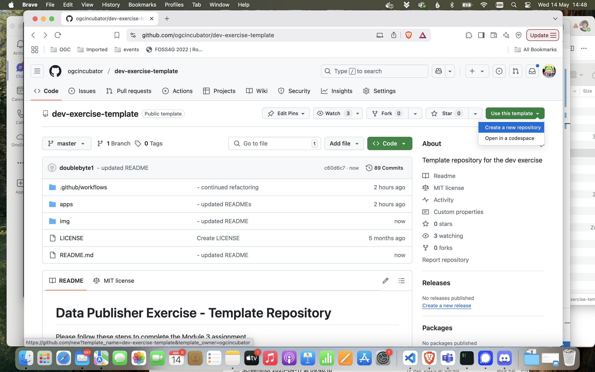

# Data Publisher Exercise - Template Repository

Please follow these steps to complete the Module 3 assignment.

Before starting, make sure that:

- ✅ *You have a GitHub account. Create one here: https://github.com/signup*
- ✅ *You have git installed in your machine. Although you are welcome to use a git UI, the instructions provided here assume you will be using the command line interface.*

## Create your repository

Go to https://github.com/ogcincubator/dev-exercise-template and create a repository from this template on your user space, following the steps in the screenshots bellow.




Clone your repository. For instance if your username were `foo` and your repo were named `data-publisher`, you would clone it in the command line interface with:

```bash
git clone https://github.com/foo/data-publisher.git
```

Then go inside that repository. The rest of the exercise will be done there.

```bash
cd data-publisher
```
## Complete the exercise

Go to the [`apps`](./apps/) folder and choose one implementation from there. Specific instructions to run an OGC API server and publish data using that technology can be found on the implementation's folder.

## Submit your assignment

After ensuring the dataset is published with the implementation you selected, commit your results and push them to GitHub to trigger the compliance test action. In order to pass the assignment you need to successfully pass the compliance tests, which means your setup can standup a valid OGC API - Features endpoint.

You can check the results of the test, on the `Actions` tab of the repository.


If the GitHub action failed, there is probably something wrong with your setup. Try checking your configuration and run the server again. If you want to run the action locally, before pushing your results to the GitHub repository, you can use [act](https://github.com/nektos/act), replacing `foo` with the name of your job: 

```bash
act -j foo
```

For instance, if you were testing a pygeoapi implementation:

```bash
act -j pygeoapi
```

## Note about Compliance

This assignment tests if a server is compliant with OGC API Features - part 1 & 2. In order to be compliant, the server needs to pass at least the mandatory tests.

The compliance tests use the [cite-runner](https://github.com/OSGeo/cite-runner) and the [team-engine](https://github.com/opengeospatial/teamengine) projects. Find more about compliance and certification on the cite website: https://cite.opengeospatial.org/teamengine/