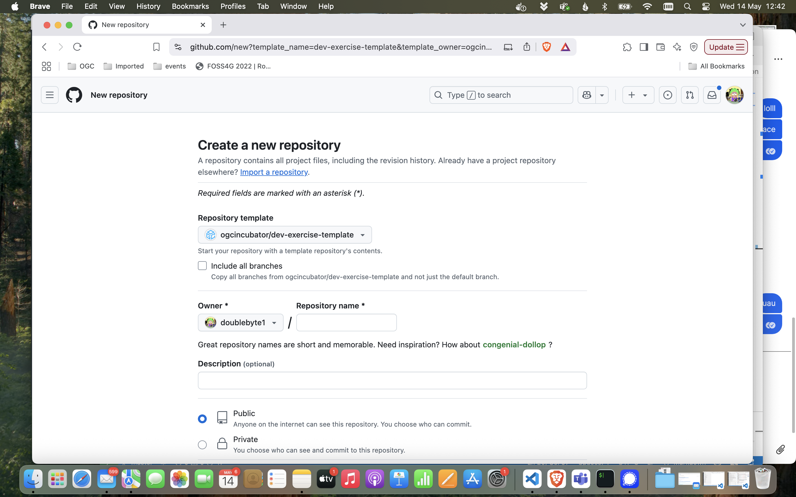

# Data Publisher Exercise - Template Repository

Please follow these steps to complete the Module 3 assignment.

Before starting, make sure that:

- ✅ *You have a GitHub account. Create one here: https://github.com/signup*

## Create your repository

Go to https://github.com/ogcincubator/dev-exercise-template and create a repository from this template on your user space, following the steps in the screenshots bellow.




Clone your repository. For instance if your username were `foo` and your repo were named `data-publisher`, you would clone it in the command line interface with:

```bash
git clone https://github.com/foo/data-publisher.git
```

Then go inside that repository. The rest of the exercise will be done there.

```bash
cd data-publisher
```
## Complete the exercise

## Submit your assignment