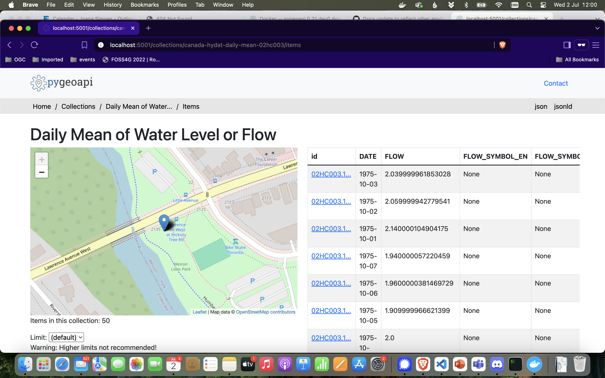

# pygeoapi

This repository contains the necessary files to standup an implementation of pygeoapi and publish the data on the [data](./data) folder.

[pygeoapi](https://pygeoapi.io/) is a Python server implementation of the OGC API suite of standards. It is a Reference Implementation for OGC API - Features, OGC API - Tiles and OGC API - Environmental Data Retrieval, and compliance certified for OGC API - Processes.

You can learn more about pygeoapi in the [Diving into pygeoapi Workshop](https://dive.pygeoapi.io/).

## Quick-Start

Start the server with:

```bash
docker compose up
```

Or, if you want to run it in the background:

```bash
docker compose up -d
```

The landing page is available at: http://localhost:5001/

```bash
curl -I http://localhost:5001/
```

If you have started the server in the foreground, you can stop it with `Ctrl+C`. Otherwise, type:

```bash
docker compose down -v
```

## Explore the API

Once your server is up & running, you can check the available collections on the `collections` endpoint: 

* http://localhost:5001/collections

You can view information about the `Daily Mean of Water Level or Flow` on the `collection` endpoint:

* http://localhost:5001/collections/canada-hydat-daily-mean-02hc003

You can get the data (in GeoJSON) on the `features` endpoint:

* http://localhost:5001/collections/canada-hydat-daily-mean-02hc003/items



For a complete (interactive) list of the endpoints provided by this OGC API implementation, you can navigate to the `openapi` endpoint: 

* http://localhost:5001/openapi


## About the Data

On the [data](./data) folder you will find an tinydb database containing daily means of water level or flow. The daily mean is the average of all unit values for a given day. This dataset is provided by the [National Hydrological Service (NHS) of Canada](https://wateroffice.ec.gc.ca/).

## Long Explanation of What is Happening

Once you start the server with `docker compose`, docker compose will read the services configuration on [docker-compose.yml](./docker-compose.yml).

```yaml
services:
  pygeoapi:
    image: geopython/pygeoapi:latest

    container_name: pygeoapi

    ports:
      - 5001:80
    environment:
      - PHOST
    volumes:
      - ./pygeoapi.config.yml:/pygeoapi/local.config.yml # Config file
      - ./data:/data # Pull data from here
    networks:
      - my-shared-network
```

In a nutshell: this configuration starts a service called pygeoapi based on the latest docker image of pygeoapi. It also mounts the data folder, where the dataset is stored and a pygeoapi config file - [pygeoapi.config.yml](./pygeoapi.config.yml). This file dictates the behavior of the pygeoapi server, establishing things such as server metadata (e.g.: title, description, contact point) and specifying which datasets are going to be published and how.

If you would like for instance to update the title of your server, search for this section of the file and update `OGC API Instance` to something else.

```yaml

metadata:
    identification:
        title: OGC API Instance
        description: pygeoapi instance in support of the OGC APIs for Data Publishers Training Course
        keywords:

```

Then save the file and start your pygeoapi server again, with docker compose. You should see the updated title reflected on the landing page.

**Warning:** *Be very careful when changing things on the pygeoapi config file, as you can break the server with an invalid configuration. One common error is to break the yaml indentation. As long as you don't commit your changes, you can always revert to the original configuration with*:

```bash
git checkout .
```

## Submit your Assignment

Whether you made changes on the pygeoapi configuration or used the default files, once you checked the server is up & running and everything works, please go back to ["Submit your assignment" section](../../README.md#submit-your-assignment) of the top-level README file, for instructions on how-to submit you assignment.